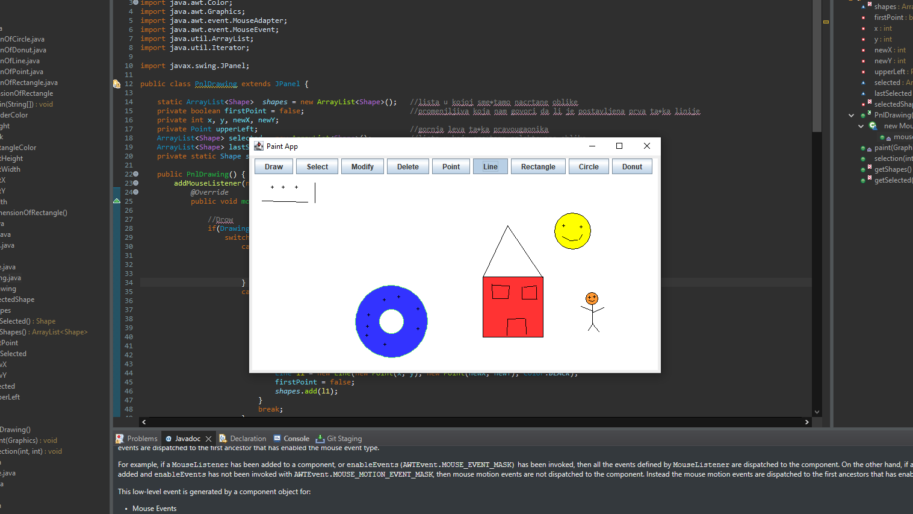

# Java Paint App
## Implementation of a Java Swing application that allows drawing, selection, modification and deletion of two-dimensional graphic shapes:

### Point 

At click point

### Line 

Between two clicks

### Rectangle 

Top left point at click point, user to enter width and height

### Circle 

Center at click point, user to enter radius length

### Circle with a hole 

Center at the point of click, user to enter the lengths of the outer and inner radius

---

## Picture of the app

